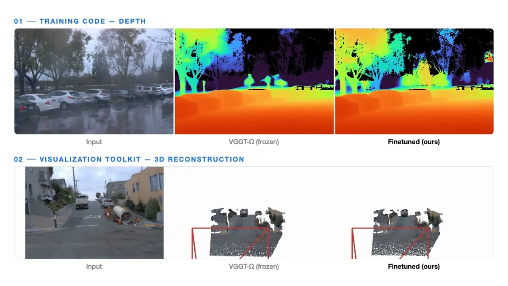

<!--
  Discoverability lives in the slug, the description and the topics, not in the title: GitHub ranks
  repository search on slug > description > topics, with README content a distant fourth. "Omega-Forge"
  contains none of the words anyone will type, so those three fields carry all of it.

    slug         finetune_omega               (tokenizes to: finetune / omega)
    description  Omega-Forge: unofficial code to finetune or train VGGT-Omega (VGGT-Ω) on your own
                 dataset, for use while official training code is not yet available. Additionally
                 includes a standalone zero-GPU 3D reconstruction visualizer.
    topics       vggt, vggt-omega, finetune, finetuning, fine-tuning, training, 3d-reconstruction,
                 depth-estimation, camera-pose-estimation, pose-estimation, point-cloud, visualization,
                 feed-forward, pytorch, computer-vision, 3d-vision

  Note "VGGT-Omega" in ASCII, not "VGGT-Ω": GitHub search treats the glyph and the word as different
  strings, so the ASCII spelling has to appear in the fields that rank. The slug carries no "vggt",
  so the description and the topics are the only things that can.
-->

# Ω-Forge

**Finetune [VGGT-Omega](https://github.com/facebookresearch/vggt-omega) (VGGT-Ω) on your own data, then see what it predicts.**

An unofficial training implementation, written because official training code is not yet available. Additionally, and separately, a standalone 3D reconstruction visualizer that needs no GPU and no PyTorch.

**If you find this repository useful, please give it a ⭐, Thanks!** 


<p align="center">
  
</p>

<sub>
Two views of one clip.
**Top row:** predicted depth.
**Bottom row:** the same prediction unprojected into a 3D point cloud, with the camera path and view
frustums building up frame by frame, rendered with `visualization/`.
Left to right in each row: the input video, frozen VGGT-Omega, and the same model after finetuning with
`training/`. The finetuned model recovers the road plane and the vertical structure the frozen model
loses.
</sub>


---

## What this is

[VGGT](https://github.com/facebookresearch/vggt) reshaped feed-forward 3D reconstruction and
[VGGT-Ω](https://github.com/facebookresearch/vggt-omega) pushed it further. Official training code has
not been released yet, so if you want to adapt VGGT-Omega to your own data today, that part is
something you have to write. We wrote it for ourselves, and this is it, in case it saves you the same
work.

**`training/`** is an unofficial training implementation. Point it at a JSONL manifest of posed RGB-D
frames and it adapts the depth and camera heads to your domain, with a held-out validation loop as the
control. It is **not** a reproduction of the authors' procedure, and we are careful to say so:
see [Relation to the original work](#relation-to-the-original-work).

**`visualization/`** is an extra. We built it to understand our own results and are including it in case
it is useful to you. It is a standalone reconstruction viewer that imports neither PyTorch nor VGGT-Ω,
so it will render *any* reconstruction, whatever produced it, on any machine, with no GPU. Watching the
point cloud assemble itself in 3D turns a bad prediction from a number into something you can see.

Finetuned separately on two benchmarks with one unchanged recipe, **depth improves on both** (AbsRel
down 35% and 60% on held-out test) and **rotation improves on both**.
[See the tables.](#results)

And one thing we did not expect, which turned out to matter more than any of that:

> **The image resize in your data loader may be costing you more accuracy than finetuning will ever
> give back.** On a 1.78:1 source, simply not stretching the frame improved the *frozen* model's depth
> AbsRel by **41%**, with zero training. That is a bigger gain than our entire finetune produced.
> [Why, and what to do about it.](#1-your-image-framing-may-cost-more-than-finetuning-gains)

## What's inside

### `training/`: unofficial VGGT-Ω finetuning

Adapt a pretrained VGGT-Ω to **your** domain from a single JSONL manifest of posed RGB-D frames.

* **Dataset-agnostic.** One manifest of `rgb`, `depth`, `intrinsics` and `extrinsics` per frame. There
  is no dataset-specific code anywhere. Depth may be **sparse**: the loss masks on `depth > 0`, so you
  can supervise straight from a COLMAP point cloud or raw LiDAR returns with no densification step.
* **Non-invasive.** A pure add-on to `vggt_omega`, imported and never forked. The output is a plain
  `VGGTOmega` `state_dict` that loads with the ordinary loader. No wrapper at inference.
* **Conservative by construction.** The backbone stays frozen except its last blocks, which train at a
  0.15x micro-LR. You adapt the top of the network without rewriting what it already knows.
* **Validation-gated.** The best checkpoint is chosen on held-out scenes, and it is saved *only* when
  depth (AbsRel) **and** trajectory (ATE) both beat the frozen model while δ<1.25 does not regress.
  Early-stop included. Never selected on train loss.

**→ [training/README.md](training/README.md)** for the recipe, config reference, data format, and how to
pick your settings.

### `visualization/`: 3D reconstruction reveal videos

Turn any reconstruction into a video where the coloured point cloud, the camera trajectory and the view
frustums build up frame by frame, in the style of the clip above.

* **Zero-GPU, zero-torch.** A pure NumPy and Pillow software rasterizer. It imports neither PyTorch nor
  VGGT-Ω, so it runs anywhere, on any reconstruction, whatever produced it. No GPU, no Open3D, no OpenGL.
* **Side-by-side comparison.** Render `Input | GT | frozen | finetuned` in one panel, each method
  scale-aligned and reveal-synchronized, so you can *see* what a finetune changed.
* **Several camera paths.** Third-person follow, fixed bird's-eye, or a cinematic push-in-then-orbit.

**→ [visualization/README.md](visualization/README.md)** for input formats, views and options.

## Quickstart: finetune VGGT-Omega on your own data

First, [bring your own VGGT-Ω](#setup). Then:

```bash
# 1. Look at your data before you train. It prints the config your dataset needs.
python training/inspect_manifest.py your_manifest.jsonl

# 2. Fill the two placeholders in training/configs/finetune.yaml (init, data.manifest), then:
cd training && bash run_train.sh configs/finetune.yaml

# 3. Score the result on a split training never saw.
python eval.py --ckpt runs/finetune/best.pt --manifest test.jsonl --out results.json
```

The visualizer needs no VGGT-Ω at all:

```bash
cd visualization && python render_reconstruction_video.py --result-dir <your_reconstruction>
```

## Results

Each benchmark was finetuned **separately**: one run per dataset, the same recipe, no per-dataset
tuning, nothing changed but the manifest. Every number is measured on a **held-out test split that
training never saw**, under one protocol (512 px, 4-frame clips). Depth is scale-invariant (per-image
median alignment), ATE is the Sim3-aligned trajectory RMSE, and RPE-rot is the geodesic per-step
rotation error. 

### Depth

Finetuning improves depth on **both** benchmarks, by a wide margin, from a static hand-held capture
(DL3DV) to LiDAR-supervised driving footage (Waymo).

| Metric | Model | DL3DV | Waymo |
|---|---|---|---|
| **AbsRel ↓** | VGGT-Ω | 0.1544 | 0.3956 |
| | **finetuned** | **0.1010** | **0.1599** |
| **δ<1.25 ↑** | VGGT-Ω | 0.8017 | 0.5005 |
| | **finetuned** | **0.9071** | **0.7704** |

### Camera pose

These are **medians over clips**, not means, and that choice is load-bearing.

| Metric | Model | DL3DV | Waymo |
|---|---|---|---|
| **RPE-rot ↓** | VGGT-Ω | 0.4944 | 0.6300 |
| | **finetuned** | **0.3651** | **0.5319** |
| **ATE ↓** | VGGT-Ω | 0.0060 | **13.44** |
| | **finetuned** | **0.0043** | 13.79 |

Rotation improves on both benchmarks. Trajectory improves on DL3DV and is a wash on Waymo. The Waymo
result is a property of the data, not of the model: a 4-frame Waymo clip spans a median of 124 m of
driving, so consecutive frames barely overlap and both pose heads sit in the same failure regime. Depth
does not need that overlap, which is why depth still gains 60% on the very same clips.


## Lessons

The five things that cost us the most time. Each one is a silent failure: nothing crashes, no metric
screams, the model just quietly learns the wrong thing.

### 1. Your image framing may cost more than finetuning gains

The backbone wants a square input. Your camera almost certainly does not produce one. The obvious move
is to resize the frame to a square and rescale `K` to match, which keeps the pinhole model exact. That
is what our loader did, and it is what produced every checkpoint in the table above.

It is also expensive. Frozen model, no training at all, same clips, same ground-truth depth pixels, only
the framing changed, on a source with a 1.78:1 aspect ratio:

| `data.aspect` | AbsRel ↓ | δ<1.25 ↑ | |
|---|---|---|---|
| `square` | 0.1492 | 0.8080 | stretch the frame, rescale `K` |
| **`pad`** | **0.0876** | **0.9180** | **41% better, for free** |
| `crop` | 0.0754 | 0.9345 | 49% better, but it drops field of view |

Read that again. **Not distorting the input beat our entire finetune** on that dataset: 0.149 to 0.088
by reframing, against 0.149 to 0.101 by finetuning at `square`. The backbone was pretrained on
undistorted images, and a 1.78:1 frame stretched into a square is already far enough outside that
distribution to cost it dearly. A wider source can only be worse.

So run `python training/inspect_manifest.py <your.jsonl>` **before** you train anything. It reads your
data and tells you which framing it needs. `square` remains the config default only because it is what
the runs behind the results table used. It is probably not the right choice for you.

### 2. A naive pose loss collapsed our camera head

VGGT-Ω predicts camera poses **frame-0-relative and up-to-scale**, while your ground truth lives in
world units. Put an L1 on the translations and the loss is dominated by that scale mismatch rather than
by any pose error. The gradient then asks the camera head to fix a discrepancy that is not its fault.
In our runs the head collapsed, and it did so quietly: the depth curve kept improving while the geometry
degraded.

Three changes fixed it for us, and together they are what let depth and pose train *jointly* rather than
against each other:

1. **Frame-0-relativize both sides.** Rebase the predicted and GT trajectories so frame 0 is the
   identity, using a rigid inverse (a transpose, never a numerically singular `inv`).
2. **Scale-normalize the translations per clip.** Divide each trajectory by its own mean camera-centre
   norm, so the loss measures trajectory *shape*. Shape is the only thing an up-to-scale model can be
   held responsible for.
3. **Use the geodesic angle for rotation**, not a raw quaternion L1, which silently double-counts
   through the quaternion double cover (`q` and `-q` are the same rotation).

One small file, no dependencies beyond torch: [`ftlib/losses_pose.py`](training/ftlib/losses_pose.py).

### 3. Sparse depth is fine. Wrong depth is not.

The depth loss and every metric mask on `depth > 0`, so a sparse map is a first-class input. You can
supervise straight from a COLMAP point cloud or from raw LiDAR returns, at 1% pixel coverage, with no
densification and no depth completion.

VGGT-Ω is already strong, so what degrades it is not *few* depth pixels but *wrong* ones. Prefer a
handful of trustworthy measurements over a dense interpolated guess. Two loss weights must go to zero
when depth is sparse, and `inspect_manifest.py` will tell you so:

* `w_grad`, gradient matching, compares **adjacent** valid pixels, and at 1% coverage almost no
  neighbouring pair is both-valid.
* `w_cons`, point-cloud consistency, samples GT depth on a dense grid, which on a sparse map is almost
  entirely invalid.

### 4. A validation split of one scene is not a validation split

Validation clips come out of the loader grouped scene by scene, and the trainer then truncates them to
`val.max_clips`. If one scene yields more clips than that budget, your entire held-out validation, the
thing that decides whether a checkpoint is saved at all, silently rests on a **single scene**. Two of
our own runs did exactly this before we caught it.

The clips are shuffled now. `inspect_manifest.py` also warns you when `val_frac` leaves fewer than two
validation scenes.

## Setup

`visualization/` is standalone: NumPy, Pillow, and any MP4 backend. Nothing else.

`training/` is a layer on top of VGGT-Ω, and this repo bundles neither the model, nor its weights, nor
its environment. Download the official release first:

1. **Clone VGGT-Ω** and install its environment, following its instructions:
   [github.com/facebookresearch/vggt-omega](https://github.com/facebookresearch/vggt-omega) (project
   page: [vggt-omega.github.io](https://vggt-omega.github.io/)).
2. **Download a pretrained checkpoint**, for example `vggt_omega_1b_512`.
3. **Make it importable.** Put the checkout on `PYTHONPATH`, or point an environment variable at it:
   ```bash
   export VGGT_OMEGA_PATH=/path/to/vggt-omega
   ```
4. On top of that environment, `training/` also needs `pyyaml`. See [requirements.txt](requirements.txt).

## Layout

```
omega-forge/
├─ assets/                  teaser.webp, promo.mp4
├─ training/                unofficial VGGT-Ω finetuning
│  ├─ configs/              finetune.yaml, finetune_cons.yaml
│  ├─ ftlib/                model_wrap, data, losses, losses_pose, val, train
│  ├─ inspect_manifest.py   read your data, print the config it needs
│  ├─ eval.py               score a checkpoint on a held-out manifest
│  ├─ run_train.sh
│  └─ README.md
├─ visualization/           3D reconstruction reveal videos
│  ├─ render_reconstruction_video.py, render_omega_samples_comparison.py
│  ├─ utils/                renderers, render_geometry, inputs, video, video_writers
│  ├─ run.sh
│  └─ README.md
├─ requirements.txt
├─ LICENSE
└─ README.md

# You provide this separately. It is NOT part of this repo (see Setup):
vggt-omega/                 the official checkout and weights; point VGGT_OMEGA_PATH at it
```

## Upstream compatibility

`training/` reaches into VGGT-Ω through a small, fixed surface: `vggt_omega.models.VGGTOmega`,
`vggt_omega.utils.pose_enc.encoding_to_camera`, the aggregator's `frame_blocks`, `inter_frame_blocks`
and `global_blocks`, and the `dense_head` and `camera_head` signatures. Nothing else. If upstream
renames any of those, [`ftlib/model_wrap.py`](training/ftlib/model_wrap.py) is the single file to
adjust. **Pin the VGGT-Ω commit you built against**, so a later rename does not surprise you.

`visualization/` reaches into nothing. It is NumPy and Pillow, and it will outlive any upstream change.

## Relation to the original work

**This is not a reproduction of the authors' training procedure.** Official training code for VGGT-Ω has
not been released, and the paper does not specify every detail one would need to reconstruct their setup
exactly. Everything under `training/` is our own implementation: choices we arrived at empirically, kept
because they worked on our data, and would gladly revise.

To be concrete about what that means:

* The freeze schedule, the learning rates, the loss weights and the validation gate are **our** choices.
  They are not the authors', and we do not claim they match what the authors did.
* The numbers in [Results](#results) are what this recipe produced on our own splits. They say nothing
  about what the authors' training procedure would achieve, and they should not be read as a measurement
  of VGGT-Ω's ceiling.
* Where this repository and the paper disagree, the paper is the authority and this repository is not.

If official training code is released, prefer it. This exists to be useful in the meantime, not to speak
for anyone else.

`visualization/` is an addition of our own. It is not part of VGGT-Ω and makes no claim to be.

## License

The code in this repository is MIT ([LICENSE](LICENSE)). It covers our code only;
VGGT-Ω has its own [license](https://github.com/facebookresearch/vggt-omega/blob/main/LICENSE).
One thing worth knowing before you train: since a finetuned checkpoint derives from
the VGGT-Ω weights, it should inherit their noncommercial terms —
check the upstream license for your use case.

## Acknowledgements

We thank the authors of VGGT and VGGT-Ω for their excellent work, on top of which this toolkit is built.

If it saved you time, a star 🌟 helps other people find it.
